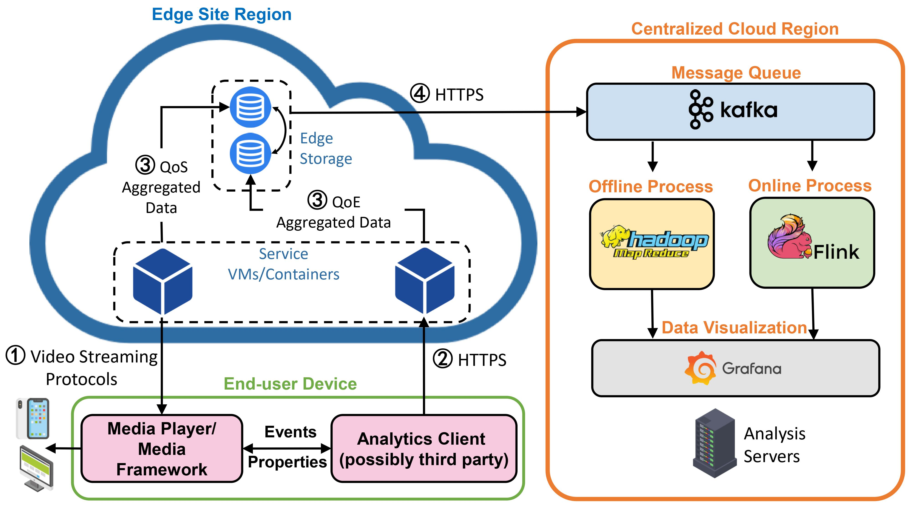

# SNESet

SNESet comprises a total of 9 million clean records with QoS and QoE telemetry metrics of 8 VSAs over four months, covering end-users from 798 edge sites, 30 cities, and 3 ISPs in one country.

We provide the artifact for our SIGMOD'24 paper, including:
- Setup
- Datasets (SNESet and all datasets for comparison)
- Characterization & Comparison
- Benchmark (Experiments for regression)


## 1. Setup

Required software dependencies are listed below:
```bash
catboost==1.1.1
matplotlib==3.5.0
numpy==1.19.2
pandas==1.1.3
seaborn==0.11.0
scikit-learn==1.1.3
scipy==1.5.2
statsmodels==0.12.2
python==3.8.5
pytorch==1.8.1
xgboost==1.7.1
```
The installation of GPU version LighGBM refers to this [link](https://lightgbm.readthedocs.io/en/latest/Installation-Guide.html#build-cuda-version) for more details.

Dependencies can be installed using the following command:
```bash
pip install -r requirements.txt
```

## 2. Datasets
SNESet and all datasets for comparison are available under the path 'datasets/'.
The datasets for comparison consists of:
1. **Huawei Dataset**. The original dataset is available at http://jeremie.leguay.free.fr/qoe/index.html. Our cleaned version is `<repo>/datasets/ICC_cleaned.csv`.
2. **Alibaba cluster-trace-v2018**. The original datasets is available at [this reporstery](https://github.com/alibaba/clusterdata/blob/master/cluster-trace-v2018/trace_2018.md). Our aggregated results are available at `<repo>/datasets/ecs/`.
3. **Edge Dataset**. The original datasets is available at [this reporstery](https://github.com/xumengwei/EdgeWorkloadsTraces). Our aggregated results are available at `<repo>/datasets/ens/`.
4. **SNESet**. The raw data of our dataset SNESet is `<repo>/datasets/training_2nd_dataset.csv`. The overall architecture of data collection and analysis is shown below. Please refer to our paper for more details about the data collection system.



## 3. Characterization
We characterize and compare the QoS and QoE metrics in SNESet with existing publicly available datasets and  ***qualitatively*** investigate the impact of QoS on QoE using Kendall correlation and relative information gain.
Please refer to `<repo>/characterization/README.md` for details.


## 4. Benchmark
We ***quantitatively*** measure the impact of different QoS metrics on QoE utilizing seven mainstream regression methods.
Considering the timeliness of real-world deployment, we compare the prediction accuracy and the time efficiency in both domain-general (for all the applications) and domain-specific scenarios (for specific applications).
Please refer to `<repo>/benchmark/README.md` for details.
