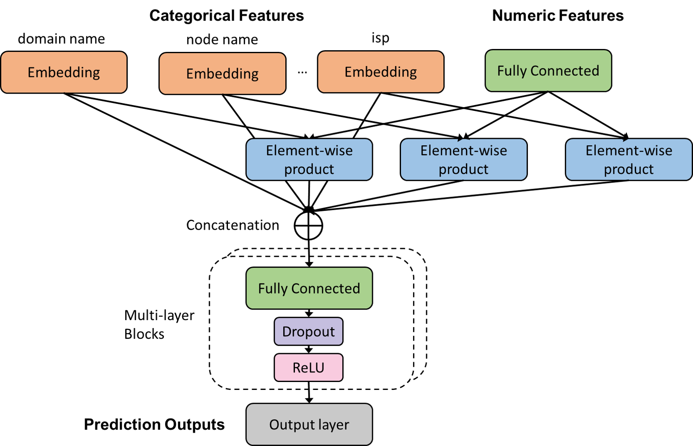

# Benchmark

## 1. Methods Taxonomy
We ***quantitatively*** measure the impact of different QoS metrics on QoE utilizing seven mainstream regression methods.
- **Classical ML methods**.
  - Linear regression-ElasticNet
  - Support Vector Machine for Regression (SVR)
  - Decision Trees (DTs)-Random Forest (RF)
- **Gradient Boosting Decision Trees (GBDT) methods**.
  - LightGBM
  - XGBoost
  - CatBoost
- **DNN-based methods**. Currently, our DNN-based model is a simple multilayer perceptron. The specific architecture is shown below. We leave more complicated DNN models built with LSTM or even Transformer as a direction for future work.


## 2. Evaluation Metrics

Considering the timeliness of real-world deployment, we compare the **prediction accuracy** and the **time efficiency** in both domain-general (for all the applications) and domain-specific scenarios (for specific applications).

Since the stall ratio typically falls between 0 and 1 and most values are concentrated between 0 and 0.03, we opt not to use Mean Squared Error (MSE) and only Mean Absolute Error (MAE) and Symmetric Mean Absolute Percentage Error (SMAPE).


## 3. Methods Implementation.
We implemented all machine learning methods using Scikit-learn 1.1.3 and employed random search to determine the best hyperparameters for each model. For the DNN model, we used Pytorch 1.8.1 with a batch size of 64 and 50 training epochs. We optimized the DNN model with the Adam optimizer, and its learning rate decayed with the ExponentialLR learning rate scheduler starting from 0.01. Additionally, we applied the same feature engineering to process the raw data for both the ML and DNN models and utilized mean absolute error as the loss function for both models. Finally, we evaluated accuracy and time efficiency using 5-fold cross-validation.


## 4. Hardware and Platform.
All the models are trained and evaluated upon a Linux server with 80 Intel(R) Xeon(R) Gold 5218R @ 2.10GHz, 819GB RAM, and NVIDIA Tesla-V100.


## 5. Evaluation Process
Folder `scripts` provide the scripts for plotting the figures (Figure 13 to Figure 18) in our paper.
We further divide the training code of domain-general scenario and domain-specific scenario in `general` and `specific`.

```shell
# For domain-general experiments, cd ./specific/, then run following command.
python elasticnet.py --data_scale 5k
```
